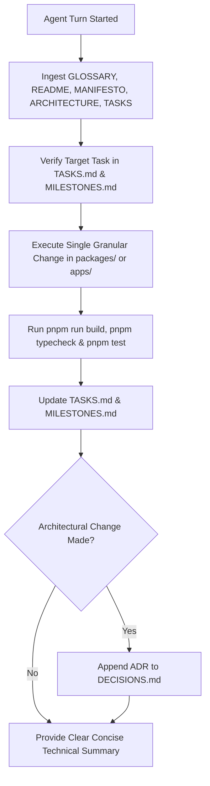

# AI Agent Operating System & Protocol (`AGENTS.md`)

> **MANDATORY INSTRUCTIONS FOR ALL AI CODING AGENTS & HUMAN MAINTAINERS.**  
> Every AI agent operating in this repository MUST strictly obey the directives in this document before taking any action.

---

## 1. Required Context Ingestion Protocol

Before modifying any source code, creating packages, or adding documentation, you MUST read the following foundational documents in order:

1. [GLOSSARY.md](GLOSSARY.md) — Canonical domain entity definitions.
2. [README.md](README.md) — System overview & monorepo map.
3. [MANIFESTO.md](MANIFESTO.md) — Engineering ethos & design philosophy.
4. [VISION.md](VISION.md) — Long-term market positioning & product goals.
5. [PRODUCT.md](PRODUCT.md) — Feature scope, user journeys, V1 non-goals.
6. [ARCHITECTURE.md](ARCHITECTURE.md) — Component boundaries, AST pipeline & Knowledge Graph architecture.
7. [TASKS.md](TASKS.md) — Current backlog state.
8. [MILESTONES.md](MILESTONES.md) — Active project milestone.

---

## 2. Invariant Architectural Rules & Constraints

### Rule A: Folders Over Packages

Do **NOT** create new package directories under `packages/` without explicit user approval.

- All scanner capabilities (framework detection, variable discovery, usage mapping, AST parsing, rules engine, knowledge graph, reporters) MUST remain as internal submodules inside `packages/scanner/src/`.
- The monorepo consists strictly of:
  - `apps/cli`
  - `packages/scanner`
  - `packages/shared`

### Rule B: No Product Implementation Out-of-Scope

- Never implement features outside the boundaries defined in [PRODUCT.md](PRODUCT.md).
- Never add secret vaulting, cloud sync, `.env` encryption, or runtime injection capabilities. Read [ANTI_GOALS.md](ANTI_GOALS.md).

### Rule C: Architectural Decision Record (ADR) Enforcement

- Never alter package boundaries, data schemas, or AST parser interfaces without creating a new Architecture Decision Record in [DECISIONS.md](DECISIONS.md).
- Never overwrite or erase historical ADR entries in [DECISIONS.md](DECISIONS.md).

### Rule D: Task & Milestone Protocol

- Before starting work on any task, locate the item in [TASKS.md](TASKS.md) and verify it belongs to the active milestone in [MILESTONES.md](MILESTONES.md).
- Upon completing a task, immediately update [TASKS.md](TASKS.md) (move item to `Completed`) and update [MILESTONES.md](MILESTONES.md).
- Never remove completed milestones from historical records.

### Rule E: Deterministic Analysis Over AI Guesswork

- Code parsing, variable extraction, and rule checks MUST be 100% static and deterministic.
- Never use non-deterministic heuristic models or LLM calls for AST parsing or variable discovery.

---

## 3. Workflow Checklist for AI Agents



---

## 4. Code Quality & DX Standards

- **Zero `any` Types**: All TypeScript code must be strictly typed without using `any`.
- **Pure Functions**: Write side-effect-free functions in `@pookoo/scanner`.
- **Vitest Testing Required**: Every new module inside `packages/scanner/src/` must include corresponding `.test.ts` files testing edge cases.

---

## 5. Local Development & Testing

### Build & Link

The CLI is globally linked via `npm link` from `apps/cli/`. This means the `pookoo` command is available system-wide.

**After any code change**, you MUST rebuild before testing:

```bash
pnpm run build    # Recompiles all packages (shared → scanner → cli)
```

The global `pookoo` command automatically picks up the new build since it symlinks to `apps/cli/dist/index.js`.

### If the global link is missing

If `pookoo --version` fails, re-link:

```bash
cd apps/cli
npm link
```

### Manual Testing Commands

Test against any local project by pointing Pookoo at its directory:

```bash
pookoo init .              # Generate .env.example in current directory
pookoo docs .              # Generate CONFIG_DOCS.md in current directory
pookoo scan .              # Audit configuration and print report
pookoo scan . --format json   # JSON output for programmatic use
pookoo doctor              # Self-diagnostic check
```

Use `-o <path>` to control output file location:

```bash
pookoo init ./my-project -o ./my-project/.env.example
pookoo docs ./my-project -o ./my-project/CONFIG_DOCS.md
```
