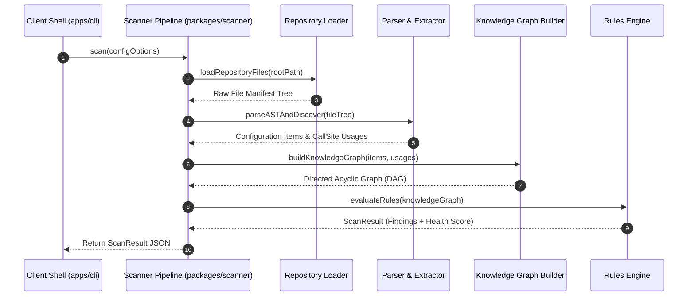

# ConfigIQ Technical Architecture

> **System Architecture & Dataflow Specification for the ConfigIQ Engine.**

---

## System Overview & Component Boundaries

ConfigIQ is engineered around a **Pure Library Architecture**. All core parsing, static analysis, graph traversal, and rule evaluations reside within the `@configiq/scanner` library package. 

Clients (such as `@configiq/cli` or future IDE extensions) act strictly as thin execution shells that invoke `@configiq/scanner` APIs and format its output findings.

Per our architectural principles, internal components are organized as clean **modular folders within `packages/scanner/src/`** rather than premature separate packages:

```
+-------------------------------------------------------------------------------+
|                            CLIENT LAYER (apps/cli)                            |
+-------------------------------------------------------------------------------+
                                       |
                                       v
+-------------------------------------------------------------------------------+
|                      SCANNER ENGINE (packages/scanner)                        |
|                                                                               |
|   +-------------------+     +------------------+     +-------------------+    |
|   | Repository Loader | --> |   AST Parsers    | --> | Framework Detect  |    |
|   |  (src/loader)     |     |   (src/parser)   |     | (src/framework-d) |    |
|   +-------------------+     +------------------+     +-------------------+    |
|                                                                |              |
|                                                                v              |
|   +-------------------+     +------------------+     +-------------------+    |
|   |  Knowledge Graph  | <-- |  Usage Mapping   | <-- | Variable Discovery|    |
|   |  (src/knowledge)  |     |  (src/usage-m)   |     | (src/variable-d)  |    |
|   +-------------------+     +------------------+     +-------------------+    |
|             |                                                                 |
|             v                                                                 |
|   +-------------------+     +------------------+                              |
|   |   Rules Engine    | --> | Report Generator |                              |
|   |    (src/rules)    |     |  (src/reporter)  |                              |
|   +-------------------+     +------------------+                              |
+-------------------------------------------------------------------------------+
                                       |
                                       v
+-------------------------------------------------------------------------------+
|                      SHARED PRIMITIVES (packages/shared)                      |
+-------------------------------------------------------------------------------+
```

Refer to [GLOSSARY.md](GLOSSARY.md) for domain definitions of *Configuration Item*, *Usage*, *Knowledge Graph*, *Rule*, *Finding*, and *Health Score*.

---

## Core Pipeline Architecture

The scanner operates as a deterministic multi-stage data processing pipeline:



---

## Subsystem Details

### 1. Repository Loader (`packages/scanner/src/loader`)
* **Responsibility**: Ingests target directory paths, respecting `.gitignore` rules, ignoring node_modules, binary assets, and heavy build directories. Builds an in-memory Virtual File Tree.
* **Inputs**: Target repository directory path, glob include/exclude filters.
* **Outputs**: Array of `VirtualFile` descriptors (`path`, `content`, `fileType`).

### 2. AST Parsing Engine (`packages/scanner/src/parser`)
* **Responsibility**: Formally parses text files into Abstract Syntax Trees.
* **Supported Grammar Types**:
  - `.env*`: Custom Dotenv AST parser capturing variable key, raw string value, inline comments, export keywords, and multiline values.
  - `.ts / .tsx / .js / .jsx`: Compiler API / SWC parser producing ESTree / SWC AST representations.
  - `.yml / .yaml`: Yaml AST parser for `docker-compose.yml` and container configurations.
  - `.json`: JSON AST parser with line-column position tracking for `package.json` and `tsconfig.json`.

### 3. Framework Detection Heuristics (`packages/scanner/src/framework-detection`)
* **Responsibility**: Inspects manifest dependencies (`package.json`), configuration file presence (`next.config.js`, `vite.config.ts`), and directory structures to infer active application frameworks.
* **Extracted Rules**: Public client variable prefix filters (e.g. `NEXT_PUBLIC_`, `VITE_`, `REACT_APP_`), server-only runtime rules, build-time replacement behaviors.

### 4. Variable Discovery (`packages/scanner/src/variable-discovery`)
* **Responsibility**: Extracts declared and implicit `ConfigurationItem` entities across `.env` files, configuration schemas (`schema.ts`, `zod` schemas), framework settings, and container environment blocks.
* **Data Interface**: Outputs `ConfigurationItem[]` with source file line numbers and default values.

### 5. Usage Mapping (`packages/scanner/src/usage-mapping`)
* **Responsibility**: Traverses JavaScript/TypeScript ASTs to locate every static access pattern:
  - `process.env.VAR_NAME` (Direct Member Expression)
  - `const { VAR_NAME } = process.env` (Object Pattern Destructuring)
  - `import.meta.env.VITE_VAR` (Vite Member Expression)
  - `config.get('VAR_NAME')` (Call Expression with String Literal)
  - `process.env[dynamicKey]` (Dynamic Indexing Accessor - flagged as unresolved dynamic reference)

### 6. Knowledge Graph Engine (`packages/scanner/src/knowledge`)
* **Responsibility**: Constructs an in-memory Directed Acyclic Graph (DAG) linking all repository configuration entities.
* **Graph Nodes**:
  - `ConfigurationItemNode`
  - `CallSiteUsageNode`
  - `SourceFileNode`
  - `SchemaDefinitionNode`
* **Graph Edges**: `DECLARES`, `READS_FROM`, `VALIDATES`, `DEFINES_FALLBACK`.

### 7. Rules Engine & Scoring (`packages/scanner/src/rules`)
* **Responsibility**: Executes a collection of deterministic rules against the Knowledge Graph DAG.
* **Built-in Rules**:
  - `NO_UNREFERENCED_ENV_VAR` (Dead configuration detection)
  - `UNDOCUMENTED_REQUIRED_VAR` (Required vars missing comments or schema entries)
  - `PUBLIC_PREFIX_SECRET_RISK` (Detecting sensitive strings bound to public client prefixes)
  - `FALLBACK_INCONSISTENCY` (Conflicting default fallbacks across multiple call-sites)
* **Health Score Formula**:
  $$\text{HealthScore} = \max\left(0, 100 - \sum (\text{FindingSeverityWeight} \times \text{Count})\right)$$

### 8. Reporter Engine (`packages/scanner/src/reporter`)
* **Responsibility**: Transforms `ScanResult` into client-requested formats:
  - `TerminalReporter`: Colored ANSI tables, syntax snippets, remediation instructions.
  - `MarkdownReporter`: Standard markdown output suitable for CI artifacts or `CONFIG_REPORT.md`.
  - `JsonReporter`: Structured JSON output for programmatic ingestion.

---

## Client Layers

### CLI Client (`apps/cli`)
A lightweight, fast Node.js executable using `commander` or `cargs` to parse command-line flags, pass settings to `@configiq/scanner`, and render formatted reports to stdout.

### Future Integrations (VS Code & GitHub Action)
Will import `@configiq/scanner` directly or execute `@configiq/cli` with `--format=json` to render inline editor diagnostics or automated PR comments.
