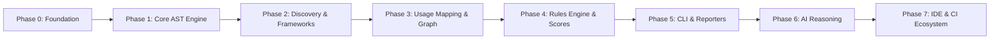

# ConfigIQ Engineering & Product Roadmap

> **Strategic Execution Plan for ConfigIQ Engine Development.**

---

## Roadmap Overview & Phases

---

## Phase 0: Repository Foundation & Engineering Blueprint

* **Status**: 🟩 **Completed (Milestone 0)**
* **Purpose**: Establish the monorepo architecture, TypeScript toolchain, engineering operating system, domain lexicon, subsystem specifications, and AI agent operating rules before writing feature code.
* **Deliverables**:
  - Root workspace setup (`pnpm-workspace.yaml`, `turbo.json`, `package.json`, `tsconfig.json`, `eslint.config.js`).
  - Architecture and culture documentation (`MANIFESTO.md`, `VISION.md`, `PRODUCT.md`, `ARCHITECTURE.md`, `GLOSSARY.md`, `AGENTS.md`, `TASKS.md`, `MILESTONES.md`, `DECISIONS.md`, `ANTI_GOALS.md`, `CONTRIBUTING.md`).
  - Subsystem specifications in `/specs/`.
  - Package boundary declarations (`packages/scanner`, `packages/shared`, `apps/cli`).
* **Definition of Done**: All configuration manifests created, linting/typechecking infrastructure active, documentation complete and validated.

---

## Phase 1: Shared Primitives & AST Parser Engine

* **Status**: 🟦 **Planned (Milestone 1)**
* **Purpose**: Build `@configiq/shared` primitive types and `@configiq/scanner/src/parser` AST parsing foundation for configuration files and source code.
* **Deliverables**:
  - Core domain interfaces (`ConfigurationItem`, `Usage`, `Finding`, `KnowledgeGraph`, `RuleDefinition`).
  - Dotenv AST parser (supporting line comments, inline fallbacks, export prefixes).
  - TypeScript/JavaScript AST parser wrapper (swc / Babel / TypeScript Compiler API).
  - YAML parser module for `docker-compose.yml` and container manifests.
* **Definition of Done**: Unit tests in Vitest achieve > 95% coverage on sample `.env`, `.ts`, and `.yml` AST fixture parsing.
* **Future Extensions**: Support for `.ini`, `.toml`, `JSON5`, and `application.properties`.

---

## Phase 2: Configuration Discovery & Framework Detectors

* **Status**: ⬜ **Backlog (Milestone 2)**
* **Purpose**: Implement `@configiq/scanner/src/framework-detection` and `@configiq/scanner/src/variable-discovery`.
* **Deliverables**:
  - File walker pipeline to locate manifest files (`.env*`, `package.json`, `docker-compose.yml`).
  - Framework heuristics engine for Next.js, Vite, Express, NestJS, and Remix.
  - Variable extractor discovering explicit and implicit Configuration Items.
* **Definition of Done**: Able to run scanner against sample Next.js and Vite repositories and accurately extract 100% of declared environment variables and framework prefix rules.

---

## Phase 3: Usage Mapping & Knowledge Graph DAG

* **Status**: ⬜ **Backlog (Milestone 3)**
* **Purpose**: Implement `@configiq/scanner/src/usage-mapping` and `@configiq/scanner/src/knowledge`.
* **Deliverables**:
  - Source file visitor mapping direct (`process.env.VAR`), destructured (`const { VAR } = process.env`), and framework accessor patterns.
  - Knowledge Graph DAG builder linking `ConfigurationItem` nodes to `CallSite` nodes, `File` nodes, and `Schema` nodes.
* **Definition of Done**: Graph correctly identifies all source call-sites for declared variables and detects dynamic indexing expressions.

---

## Phase 4: Deterministic Rules Engine & Health Scoring

* **Status**: ⬜ **Backlog (Milestone 4)**
* **Purpose**: Implement `@configiq/scanner/src/rules` engine and health scoring algorithm.
* **Deliverables**:
  - Core rule implementations:
    - `NO_UNREFERENCED_ENV_VAR` (dead config detection)
    - `UNDOCUMENTED_REQUIRED_VAR` (missing schema/comments)
    - `PUBLIC_PREFIX_SECRET_RISK` (client leak detection)
    - `FALLBACK_INCONSISTENCY` (mismatched fallbacks across call-sites)
  - Composite Health Score calculator (0.0 to 100.0).
* **Definition of Done**: Scanner outputs structured array of `Finding` objects and exact repository `Health Score` for test fixture repositories.

---

## Phase 5: `@configiq/cli` Implementation & Reporters

* **Status**: ⬜ **Backlog (Milestone 5)**
* **Purpose**: Build the command-line interface application and terminal/markdown reporter modules.
* **Deliverables**:
  - `@configiq/cli` binary executable supporting commands:
    - `configiq scan <path>`
    - `configiq graph <path>`
    - `configiq doctor <path>`
  - ANSI terminal output formatter with interactive table summaries and syntax-highlighted call-site code snippets.
  - Markdown reporter generating standalone `CONFIG_REPORT.md`.
* **Definition of Done**: End-to-end execution of `configiq scan .` in terminal returns rich colored report and proper shell exit code (`0` for clean, `1` for critical finding failures).

---

## Phase 6: AI-Augmented Reasoning Synthesis Engine

* **Status**: ⬜ **Backlog (Milestone 6)**
* **Purpose**: Introduce optional AI synthesis layer (`@configiq/scanner/src/ai`) that ingests the deterministic Knowledge Graph and generates natural language explanations for complex configuration queries.
* **Deliverables**:
  - Natural language query interface (*"Why does this variable exist?"*, *"What breaks if I remove `API_KEY`?"*).
  - Graph-to-prompt serializer passing exact AST facts to local or remote LLM providers.
* **Definition of Done**: Queries return precise human-readable explanations backed by verified AST node locations.

---

## Phase 7: Ecosystem Integrations (IDE & CI/CD)

* **Status**: ⬜ **Backlog (Milestone 7)**
* **Purpose**: Extend ConfigIQ beyond the CLI into developer workflows.
* **Deliverables**:
  - VS Code Extension (`apps/vscode-extension`): Inline annotations, hover info, dead config diagnostic squiggles.
  - GitHub Action (`apps/github-action`): Automated PR status checks and inline PR review comments.
  - Interactive HTML Visualizer (`@configiq/reporter` web view).
